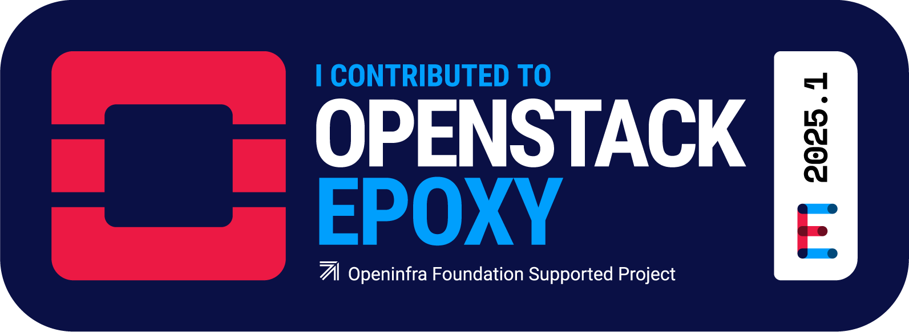

# About Myself
Hello, this is Satoshi. I'm originally from Japan and live in Canada. I'm a full-stack developer, proficient in Python and JavaScript from data science to web development. I love music and enjoy making music with keyboards and guitars in my free time.

# Freelance Works
- [Report Needles](https://reportneedles.ca/) Contributed to adding multi-organization support for reporting discarded needle. Built with WinterCMS(Laravel-based web framework)  

# Open Source Projects Achievements

[OpenStack Ironic](https://wiki.openstack.org/wiki/Ironic). Created 15 PRs and reviewed 5 PRs during the MLH Fellowship program 2025 Spring.

[My contributions](https://review.opendev.org/q/satoshi-sh)

[Taipy](https://github.com/Avaiga/taipy) is my go-to open-source project. My contributions are featured twice.

[WebDevPath](https://www.webdevpath.co/) is an open-source initiative that provides hands-on experience in a simulated professional environment to people who seek to begin or move forward in their web development journey. I have been an active member in developing and maintaining the project.

Internship at Apache Airflow through MLH Fellowship program. Please check my experience in this [post](https://dev.to/satoshi-sh/my-experience-with-apache-airflow-1dpl)

# My Portfolio
- [Portfolio](https://satoshis-developer.xyz/portfolio/) 
- [Mastlog](https://satoshis-developer.xyz/mastlog/)
- [Kaggle Profile (Data Science/Data Analytics)](https://www.kaggle.com/satoshiss)

<h2>GitHub Stats</h2>

<!---
Satoshi-Sh/Satoshi-Sh is a ✨ special ✨ repository because its `README.md` (this file) appears on your GitHub profile.
You can click the Preview link to take a look at your changes.
--->
